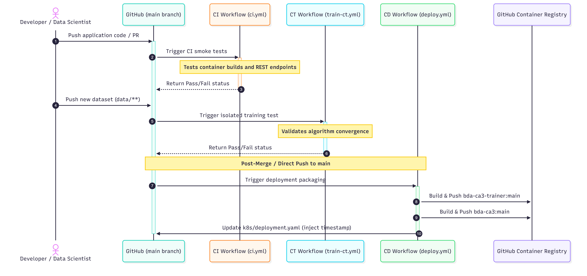
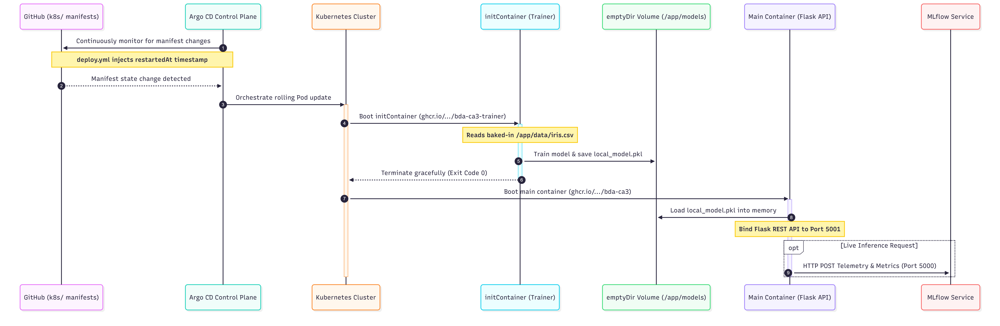

# **MLOps Pipeline CA3**

The assignment requires a complete MLOps pipeline that will automatically train, test, package, and deploy a small machine learning model as a web application. The architecture is built around three layers , each with a distinct responsibility.

### Use Case

This project impliments a full Machine Learning Operations (MLOps) pipeline. It is designed to train, package, and deploy a machine learning model (iris data). The use case focuses on predicting the species of an Iris flower based on its sepal and petal measurements inputed via the web mmi. A simple Logistic Regression model is adopted for this task given the foucs on the MLOps pipleine. The system is engineered to provide continuous integration, automated retraining upon data updates, and continuous delivery of a user-facing Flask REST web application, all orchestrated via GitHub Actions and deployed to a local Kubernetes cluster using Argo CD. MLflow is deployed to record production inferance results to track model performance.

## High Level Architecture

### **Automation Layer – GitHub Actions**

GitHub Actions is responsible for all automation. It monitors the repository and triggers actions in three key areas:

- Automatically runs Continuous Integration (ci.yml), to perform containerised smoke tests on any pull request or push to the main branch, ensuring the application code and endpoints function correctly before any deployment are made.
- Triggers model retraining when new training data is available (train-ct.yml), by monitoring the data/ directory and provisioning an isolated trainer container to validate that the algorithm successfully processes the updated dataset without failure.
- Packages the application into a Docker image for Continuous Delivery (deploy.yml), builds the autonomous trainer and app image, and pushes both to the GitHub Container Registry (GHCR).

The deploy.yml workflow updates the Kubernetes manifest file (k8s/deployment.yaml) with the new Docker image tag and commits the change back to the GitHub repository. In a full production system, a complete integration test that calls the Flask REST API endpoint would also be added to validate the full prediction flow before deployment.

Docker images are stored in GitHub Container Registry (GHCR), which integrates natively with GitHub Actions and requires no additional authentication setup.

**Layer Interface:** Git + Kubernetes manifest file.

### **Deployment Layer – Argo CD + Rancher Desktop Kubernetes**

Argo CD is responsible for orchestrating the deployment into the runtime environment. It constantly watches the GitHub repository for changes to the Kubernetes manifests. When the deploy.yml workflow injects a new restartedAt timestamp annotation into k8s/deployment.yaml via the sed command, Argo CD automatically detects the configuration change and orchestrates a rolling update to the Kubernetes cluster running on Rancher Desktop.

It pulls the latest `:main` images and instructs Kubernetes to deploy the Pod, which first runs an `initContainer` to autonomously train the model, and then seamlessly starts the main Flask web application.

**Layer Interface:** Git + Kubernetes manifest file. The deploy.yml workflow updates k8s/deployment.yaml and commits the change. ArgoCD monitors this for change via restartedAt

### **Application Layer – Docker and Flask**

The Flask web application is the user-facing part of the system. It provides a simple web-based interface where users can input flower measurements and receive a prediction. An autonomous Kubernetes `initContainer` executes the training script at deployment, saving the resulting model to a shared `emptyDir` volume. The main Flask container then mounts this volume to serve the updated model see mapping later. The application resides in the default namespace. We used a strict seperation of concerns keeping the UI (Html) seperated from backend python using a template approach.

**Layer Interface:** Docker container running as a Kubernetes Pod, exposed to users through a Kubernetes Service on a specific port 5001.

### **Automation Architecture Mapping and Interactions(GitHub)**

A breakdown of the Github elements and interactions using UML.

**Table 1: GitHub Actions Automation Logic**

| Workflow File | Trigger Event    | Primary Execution                                                             | Final Output                                                                                          |
| :-------------- | :----------------- | :------------------------------------------------------------------------------ | :------------------------------------------------------------------------------------------------------ |
| ci.yml        | Push/PR to`main` | Containerised smoke tests on application & training code                      | Pass/Fail check                                                                                       |
| train-ct.yml  | Push to`data/**` | Isolated containerised model training test                                    | Pass/Fail validation of new data                                                                      |
| deploy.yml    | Push to`main`    | Builds/pushes Docker images; updates deployment.yaml with a restart timestamp | `:main` images in GHCR; Updated Git manifest      bda-ca3-trainer or bda-ca3 |

**UML Sequence diagram**

### **Deployment & Runtime Architecture Mapping (Argo CD & Kubernetes)**

A breakdown of the K8S cluster with Argo CD control plane)

Note we use the default namespace for the local deployment however ArgoCD control plane in in argocd namespace.

**Table 2: Kubernetes Network & Storage Architecture**

| **Kubernetes Component**        | **Internal Path / Port** | **External Exposure** | **Primary Responsibility**                                                                                                                                                  |
| --------------------------------- | -------------------------- | ----------------------- | ----------------------------------------------------------------------------------------------------------------------------------------------------------------------------- |
| **`initContainer` (Trainer)**   | `/app/data/iris.csv`     | None                  | Executes automatically on Pod startup to train the model. Image bda-ca3-trainer                                                                                             |
| **Shared `emptyDir` Volume**    | `/app/models/`           | None                  | Storage bridge: Trainer saves`.pkl` here, API loads it.                                                                                                                     |
| **Main Container (Flask API)**  | Port`5001`               | None (Internal)       | Loads the model and serves the REST API endpoint. Runs in default namespace                                                                                                 |
| **API LoadBalancer Service**    | Target Port`5001`        | `localhost:5001`      | Routes external user traffic into the Flask API Pod. Layer 4 balancer is used routing all tcp traffic. In a real production we would look at ingress layer 7 load balancer. |
| **MLflow Container**            | Port`5000`               | None (Internal)       | Receives live inference metrics and parameters. Production interance results and ionputs are stored in CA3_OPE_RESULTS                                                      |
| **MLflow LoadBalancer Service** | Target Port`5000`        | `localhost:5000`      | Exposes the MLflow Web UI to external users. Runs in Default namespace                                                                                                 |

**UML Sequence diagram**

### **Branching Strategy**

A Trunk Based Development strategy is adopted. The main branch serves as the definitive, production-ready source of truth. All code modifications, bug fixes, and data updates are integrated directly into this primary branch. Any push or merged pull request to main acts as the trigger for the automated Continuous Integration (CI ci.yml) and Continuous Delivery (CD deploy.yml) github workflow pipelines. Each version delivered at the end of a development phase (see development plan) will be tagged in Git as a formal baseline.

### **Development plan**

* Phase 1 – Model + CI
* **Phase 2 – Flask + Docker**
* **Phase 3 – Full Pipeline + Argo CD**

### **Lessons Learned and Future Enhancements**

Building this pipeline highlighted several practical challenges when moving from local development to a distributed one:

* **Configuration Management:** Using `.env` files works seamlessly for local testing with Docker Compose, but Kubernetes requires `ConfigMaps` and `Secrets`. This architectural difference makes it difficult to maintain a single source of truth across environments.
* **Strict GitOps Workflow:** Because Argo CD strictly pulls from the remote Git repository, the local working directory is ignored. Forgetting to commit and push a modified file led to testing failures, highlighting the need for strict version control discipline.
* **Pipeline Latency:** Relying on cloud-based runners (e.g GitHub Actions) makes online testing very slow and time consuming. Waiting upwards of ten minutes for the pipeline to build, push, and trigger a cluster update adds significant friction to rapid iteration
* **Kubernetes Orchestration:** Managing the cluster introduced operational hurdles, such as debugging hanging containers in termination states and resolving accidental deployments to the wrong namespace (e.g., mixing up `default` and `argocd`).
* **Future Enhancement (MLflow Triggers):** Currently, retraining is only triggered by data updates. A highly valuable future enhancement would be using MLflow to track live inference performance and automatically trigger a model retraining cycle if a performance drop (model drift) is detected.

### Support Scripts

To support local development, testing, and demonstration, a suite of scripts was devloped. These scripts manage provisioning the control plane Argo CD, deploying the MLflow, tearing down the environment.

**Table 3: Local scripts**

| **Script Name**     | **Execution Order** | **Primary Function**                                                                                                                                                         | **Key Output / State**                             |
| --------------------- | --------------------- | ------------------------------------------------------------------------------------------------------------------------------------------------------------------------------ | ---------------------------------------------------- |
| `start.sh`          | 1                   | Orchestrates the sequential execution of the underlying installation scripts.                                                                                                | Triggers Argo CD and MLflow provisioning.          |
| `install-argocd.sh` | Use Start           | installs ArgoCD image. Applies application manifests, extracts the initial admin password, and establishes local port-forwarding.   Start uses this for Argo       | Argo CD UI accessible at`localhost:8080`.          |
| `start-mlflow.sh`   | Use Start           | Deploys the MLflow tracking server and LoadBalancer service into the`default` namespace. Pauses execution until the Pods achieve a ready state. Start uses this for MLflow.  | MLflow UI accessible at`localhost:5000`.           |
| `shutdown.sh`       | Teardown            | Cleans the local environment. Deletes the application deployments, terminates the designated namespaces, and kills background port-forwarding processes.                     | Cluster returned to a clean, pre-deployment state. |

#### **Sources**

Gift, N. & Deza, A., 2021. _Practical MLOps: Operationalizing Machine Learning Models_ . Sebastopol, CA: O’Reilly Media.

The Kubernetes Authors, 2026. *Kubernetes Documentation*. Available at: [https://kubernetes.io/docs/](https://kubernetes.io/docs/).

Argo Project Authors, 2026. *Argo CD - Declarative GitOps CD for Kubernetes*. Available at: [https://argo-cd.readthedocs.io/](https://argo-cd.readthedocs.io/) .

MLflow Project Authors, 2026. *MLflow: A Tool for Managing the Machine Learning Lifecycle* . Available at: [https://mlflow.org/docs/latest/index.html](https://mlflow.org/docs/latest/index.html).
